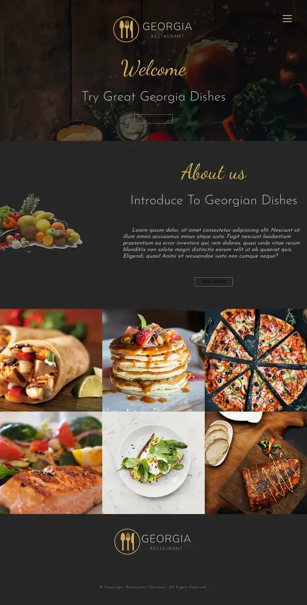

# Udemy - GEORGIA-restaurant Project

This is the 1st project of [SASS - The Complete SASS Course (CSS Preprocessor) - Course](https://www.udemy.com/share/101D1k3@iQu9MvNPZ4yRhU_t7WhieGeBBnH9RFjtBVb-R9CKeIPMdwHck7OVZbMA7knxGAVj/).

## Table of contents

- [Overview](#overview)
  - [The challenge](#the-challenge)
  - [Screenshot](#screenshot)
  - [Links](#links)
- [My process](#my-process)
  - [Built with](#built-with)
- [Author](#author)

## Overview

### The challenge

- Hamburger menu
- Hover states for gallery images
- Images optimization
- Using CSS preprocessor (SASS)

### Screenshot

### Links

- URL: [GEORGIA Restaurant](https://mosaadisalem.github.io/GEORGIA-restaurant/)

## My process

### Built with

- Semantic HTML5 markup
- CSS Flexbox
- SASS: Variables, Nesting, Mixins.
- Desktop-first workflow

## Author

- [@MoSaadiSalem](https://mosaadisalem.github.io)
